# GSoC Blog


## 1. Introduction

### 1.1 Dagger.jl Recap

#### *Parallelism Made Easy*


It is typically a cumbersome exercise, for programmers, to quickly and efficiently deploy multithreaded, distributed, or GPU computations.

Doing all three at once is then certainly no easy feat — but that is where [Dagger.jl](https://github.com/JuliaParallel/Dagger.jl) swoops in!

Dagger is a Julia module that brings all three together and makes parallelism easy for the user — it acts as a unified task interface and aims to solve difficult problems such as:

- Cross-task dependency/synchronization
- Abstracting computation across servers, threads, and GPUs
- Dynamic workload balancing
- Automating data transfer and worker migration, while hiding latency
- Automating GPU utilization and data conversion

As a result, though the user might not be very familiar with concurrency and parallel programming, by leveraging Dagger's APIs, the user is able to be productive while doing high performance computing.

See Dagger's parallelism capabilities through the 3 lines of code below:

```Julia
for i in 1:10
    Dagger.@spawn sleep(1)
end
```
<p align="center">
  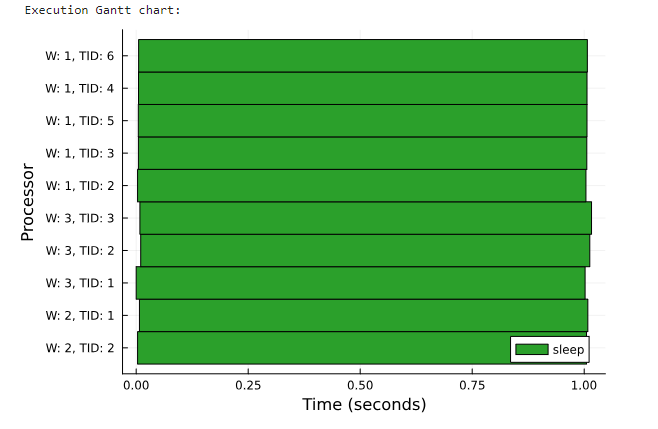
</p>

<small>*Image credit: [J.Samaroo Dagger Workshop](https://github.com/jpsamaroo/DaggerWorkshop2024/blob/main/DaggerWorkshop2024.ipynb)*</small>

Ta-da! Obviously, while showcasing how parallelizable a bunch of `sleep()` calls is silly, it is just to get the point across that Dagger can make parallelism easy

If you want to learn more about how Dagger works or want to deep-dive into the specifics of how Dagger makes all of this happen behind the scenes, check out the [Dagger Workshop](https://github.com/jpsamaroo/DaggerWorkshop2024) from the [Productive Parallel Programming](https://www.youtube.com/watch?v=ENq05cxw1eY&t=1388s) conference at JuliaCon 2024!

### 1.2 Our proposed objectives

#### *Enter: DAGs*

Dagger has recently been incorporating streaming functionality in its `jps/stream2` branch, which allows users to implement task Directed Acyclic Graphs (DAGs) as a streaming graph of connected tasks (see examples below). Again, these *streaming* tasks can then seamlessly be deployed in a multi-threaded, multi-process fashion which can also leverage a heterogeneous set of computing resources.

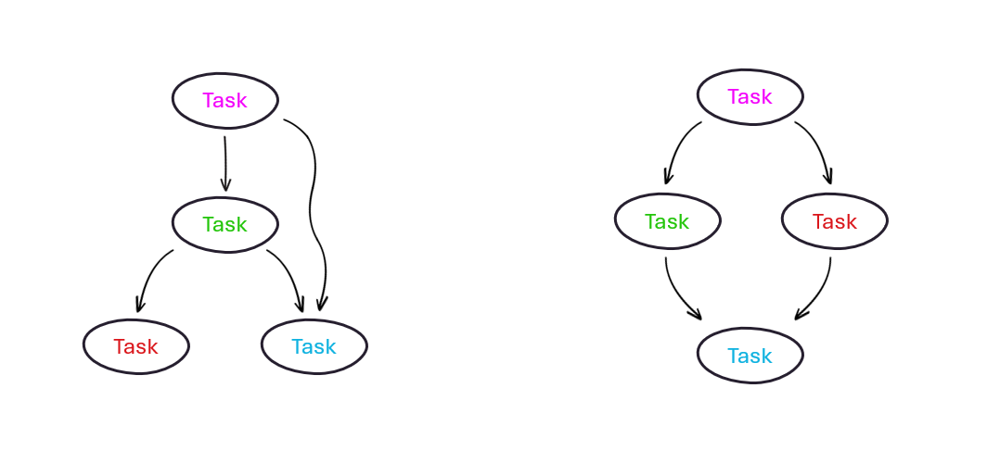

At the beginning of the GSoC contribution program, we set some ambitious goals:

1. **Tooling for Task Execution Validation**: we aimed to develop tools to ensure tasks execute with minimal memory allocation, which would enhance performance by avoiding garbage collector pauses and overhead from allocation itself.
2. **Data Transfer Mechanisms**: we set out to implement an optimized mmap-backed ring buffer for inter-process communication and also implement support for various protocols (TCP, UDP, NATS, MQTT) for cross-network transfers.
3. **Heterogeneous Streaming Infrastructure**: we proposed to create infrastructure to facilitate executing streaming tasks on GPUs/DPUs and streaming data directly to/from them and CPUs.
4. **Performance Benchmarking**: we wanted to benchmark the streaming DAG performance using a standard benchmark problem to assess efficiency improvements.
5. **Robustness Testing**: lastly, we ideally would have implemented a set of benchmarks of streaming DAG performance, using real-world radio/RADAR analyses and source data to assess efficiency and reliability.

****

## 2. GSoC Code Additions

To tackle all these goals, the first step was to validate what was already in place, identifying potential faults, bugs, or inefficiencies — in other words, we needed to create an exhaustive streaming testset which would probe all potential pain points of our vision.

###### *NB: many of these features were done in collaboration with mentors J.Samaroo and J.Wrigley — commits may be coauthored.*

### 2.1 Building a Streaming Testset

To gain more confidence in the robustness, effectiveness, and versatility of streaming tasks, a comprehensive collection of tests was written during the first few weeks.

These included many possible combinations for DAGs — namely single tasks running finitely or infinitely, multiple configurations of tasks (1 → 2, 2 → 1, diamond, hourglass as per figure below), which were spawned themselves on combinations of different threads and workers.

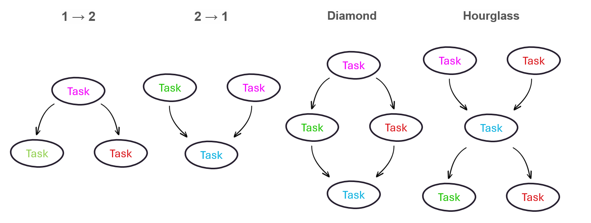

<!-- Afterward, the allocation of task streams was also gauged to earn more confidence around `stream.jl`’s ability to not require further allocation — effectively slowing down performance, increasing the number of calls for garbage collection, and adding overhead. -->

The full test list, at this point of the program, is provided below:

- Checking a single "finite" task correctly finishes and returns
- Checking single "infinite" task never finishes and keeps spinning
- Checking all DAG configurations above and simpler correctly and predictably finish
- Checking tasks can stream different element types, e.g. mutable and immutable
- Checking all of the above tests continue passing if we mix up the threads and workers we allocate them to — ensuring cross-worker streaming

The new streaming feature ultimately passed all initial tests, which seemed to awarded enough reliability to `stream.jl` that we could start thinking about networking protocols implementation for streaming data.

<!-- which earned the developers enough confidence to merge it with the main branch. -->

#### `Commit links:`

- [Adding first tests](https://github.com/davidizzle/Dagger.jl/commit/1f00a670acafc6d36448deb34f9805a8a17cb194)
- [Mixing workers and threads test](https://github.com/davidizzle/Dagger.jl/commit/6c6599a9f8fab4673f0375f1a74f793ae75b3ece)
- [Corrections](https://github.com/davidizzle/Dagger.jl/commit/d1ec262fc9299e56c6c22deff686c1ba26fee75a)
- [More tests added](https://github.com/davidizzle/Dagger.jl/commit/7b9b057729be4682306929d97f9cd99e79e14c64)

### 2.2 Testing Networking Protocols

Given the desire to build Dagger’s streaming functionality towards heterogeneous computing and highly performing network communication, several networking protocols were tested.

Workers were able to communicate over the wire through Julia’s built-in TCP and UDP libraries effectively — with scripts initially testing transmission of singular and vectors of `Float64` values without serialization, respectively.

For MQTT and NATS — popular message queue protocols, the former often used in IoT and the latter in microservices for its lightweight nature — libraries were sourced within the Julia community, respectively employing [Mosquitto.jl](https://github.com/denglerchr/Mosquitto.jl) and [NATS.jl](https://github.com/jakubwro/NATS.jl). Message queues work via a pub/sub system, where certain workers publish to a message queue, and only the workers subscribed to the same queue (see: topic) receive the data — in this case, a single publisher was tested to publish single and vectors of `Float64` values, with a single subscriber successfully pulling the data from the message queue.

The Dagger API for specifying a networking protocol would be on a "per-upstream-task", or per-edge, basis. The DAG configurations and protocols illustrated below are a random example.

<p align="center">
  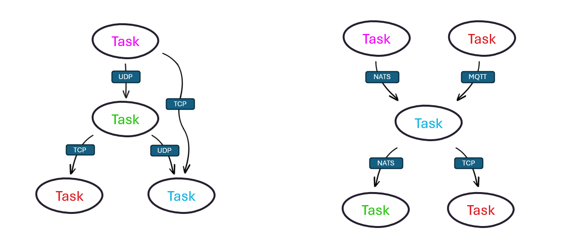
</p>

#### `Commit links:`

- [First draft of pull/push network protocols...](https://github.com/davidizzle/Dagger.jl/commit/05aa462d7ee732a8d4a15eb5656bcdecfcefabf0)
- [...with corrections](https://github.com/davidizzle/Dagger.jl/commit/1babb00ee710e1754a14023b0258e9a75e9e64b1)

### 2.3 Memory-Mapped Ring Buffers

Through the `Mmap.jl` library, which helps with memory-mapping of files, a new type of buffer was initially implemented in the following couple of weeks — an `mmapRingBuffer`, i.e. a ring buffer that maps data on disk, allowing direct access to the data without loading it into memory, thereby reducing overhead. The rationale behind a memory-mapped ring buffer is to eliminate the overhead from allocations of extra space when copying buffer data, but rather having a downstream task in a DAG access the same memory used by the upstream’s ring buffer.

By way of background, a "ring" — or circular — buffer is a data structure that uses a fixed-size buffer in a circular way, i.e. where both ends are connected. This structure includes a 'reading' pointer and a 'writing' pointer as below, and is historically useful for buffering data streams.

<p align="center">
  
</p>

<small>*This gif was provided by [Wikimedia Commons](https://commons.wikimedia.org/wiki/File:Circular_Buffer_Animation.gif)*</small>

This was implemented locally, but ended up being tabled. This idea went through many redesigns and the original design "bitrotted". There does not seem to be a clear way to determine when to automatically use this.
On top of this, in the new redesign with `RemoteChannel` (see more later), tasks are not directly connected anymore — instead using normal ring buffers to connect them to their inputs and outputs.
A memory-mapped ring buffer's role is now less clear — hence no commits were ever made with this specific change. It remains in the to-dos for potential future use or clarification.

### 2.4 Graceful cancellation and signal interrupts

The biggest detour from the original objective list during the GSoC program was likely the realization of the necessity to implement a requested and highly useful feature for any multi-threaded, distributed library: the possibility to cancel scheduled and executing tasks alike, which may otherwise keep spinning indefinitely.

This, effectively, meant altering the very way Julia handles signal interrupts (see: Ctrl+C's) from the user — including alternative ways that clean up left over tasks.

The main Dagger developers were busy creating a pull request for this, including a global handler of signal interrupts, as well as a much needed Dagger feature for seamless cross-worker task migration.

My work, besides reading through their code, trying to understand and test it, and catching possible bugs ( Commit #1 ), partly included putting together a PR that would include signal interrupt support from `Julia.Base` for most popular parallel computing libraries — namely `Distributed.jl`, `CUDA.jl`, `AMDGPU.jl`, `oneAPI.jl` amd Julia's very own `Base.Threads`.

This was initially a quite challenging part of the program, as it required grappling with a codebase much larger than Dagger — though the latter builds on top of a number of other libraries.
Commit #1-2-3 also included some tests to check successful cancellation and print statements to better debug the source code.

The first attempt at ubiquitous cancellation, showcased in commit #4, was quite forceful and required raising an `InterruptException` on all active threads, not just the main one (as would normally happen). This is why I baptized this commit `forceful`, given that it made use of the native `Base.throwto()` function which does not concern itself with safe cancellation — calling it graceful would be a stretch of vocabulary. `Base.throwto()` is deemed a dangerous function and its use is often unadvised. 

As a result, this required concocting a new way to cancel multi-threaded jobs — and possibly, one more gentle at that. After more digging, it became apparent that it should be possible to modify the native `Base.Threads` expression parser used in the `@threads` macro, and recursively add cancellation checks for every expression line, i.e. for every one evaluation in the abstract syntax tree.

<p align="center">
  
</p>
<small>

*Image credit: [Ruslan Spivak's Blog](https://ruslanspivak.com/lsbasi-part7/)*</small>

This code was ultimately running successfully and added to the final commit #5 — it has the advantage of implementing *truly graceful* cancellation as any task can simply quit execution and return prematurely, but the disadvantage of potentially adding overhead.

Similar work should be carried out for each of the aforementioned libraries — though that will take more time and will be in the pending to-dos for this project.

#### `Commit links:`

- [Minor bug fixing, interrupt testing](https://github.com/davidizzle/julia/commit/b9410663a03a063ead2772876fe2c7fb671a2cda) and [more](https://github.com/davidizzle/julia/commit/2512144e041d27b8ab62afbf51bde0288b90f618)
- [Cancellation sigint tests and including handlers](https://github.com/davidizzle/julia/commit/ff1b731c9da07b81d50958341f96e0cb67c8e421)
- [Including forceful cancellation in Base.Threads](https://github.com/davidizzle/julia/commit/32e6883420a45ea64b67cd7c7f22e704a33c4548)
- [Including graceful cancellation through expression parsing in Base.Threads](https://github.com/davidizzle/julia/commit/8e4b148549201a41bf84cf1765a38818fb73cf69)

### 2.5 Wiring up the networking protocols

As GSoC comes to a wrap, it is time to merge what is in place and works well.

This, in practice, meant expanding from remote calls only fetchers and upgrading `stream.jl`'s architecture from a fetcher-only based system to a push/pull system, where each streaming task pulls to its input buffer and pushes from its output buffer.

Some changes were made to `stream.jl` to wire up these networking protocols to use them, and even more to the Dagger.jl codebase as some [pieces bitrotted](https://github.com/JuliaParallel/Dagger.jl/pull/575) and others required being reworked, such as replacing the old `RemoteFetcher` with the new `RemoteChannel` implementation.

The streaming communication revamp was also a good opportunity to add support for the popular [ZeroMQ](https://github.com/JuliaInterop/ZMQ.jl) package, which should soon be seamlessly integrated in the protocols available with `Dagger.@spawn`.

#### `Commit links:`

- [Networking initial data structs](https://github.com/JuliaParallel/Dagger.jl/commit/667d2d9725474beca7534f6d124a37466055f7cd)
- [Bulk of networking push/pull functions](https://github.com/JuliaParallel/Dagger.jl/commit/1998cbb76667603ad8863a726904aa01610b9d2f)
- [Interim architectural corrections](https://github.com/JuliaParallel/Dagger.jl/commit/91589a15c387c09bdd4e76765bb6eacd4f1553d9)
- [Main first piece of wiring it all together with stream.jl](https://github.com/JuliaParallel/Dagger.jl/commit/7c02cdb2f257cf9a55e833814fc885b226000248)

****

## 3. Examples and use cases

##### *What worked, and what didn't (yet!)*

We now walk through a list of example use cases for Dagger, seeing what we can replicate through its API.

### 3.1 Streaming sinusoids and FFTs

Let's kick off with the first example — FFTs of streaming signal data. Given as how Dagger does not yet have batching support, we will simulate this by passing in full batches, i.e. entire stationary signals made by summing K different sinusoids.

$$s_i(n) = \sum_{j=1}^{K} A_i \sin(2\pi f_it)$$

In the above, $A_i$ is a random number from 1 to 10 and $f_i$ is a random frequency chosen from $1–500\ Hz$. $t$ is the time vector and it is constructed with $n$ samples at $\frac{1}{f_s}$ intervals — where $f_s$ is the sampling frequency.

The API simply looks like the below.

```Julia
Dagger.spawn_streaming() do
            n = 1:400
            f_s = 1200
            freq = fftfreq(n[end], f_s)
            K = 10
            l = @layout [a{.3h};b{.7h}]

            s = Dagger.@spawn rand_sinusoids_finite(n[end], K, f_s)
            ff = Dagger.@spawn fft(s)
            f = Dagger.@spawn (ff)->map(abs,ff)
            p1 = Dagger.@spawn plot(n, s, title="Time discrete signal", xlabel="Time", legend="false")
            p2 = Dagger.@spawn plot(freq, f, title="FFT of signal", xlabel="Frequency", legend="false")
            p = Dagger.@spawn plot(p1, p2, layout=l)
            d1 = Dagger.@spawn display(p)
       end
```

With some slight changes to the code, we can package the plots as a .gif file. The resulting graphs are shown below.

<p align="center">
  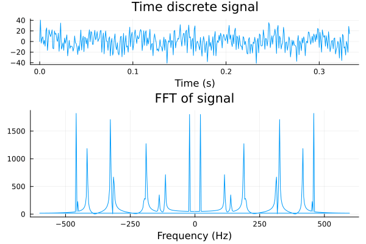
</p>

#### Comments

No particular difficulties were encountered in this implementation, Dagger worked exactly as we expected it to during building. The DAG in questions is also quite simple as — barring the plotting — it is entirely sequential.

#### `Commit links:`
- [Main commit](https://github.com/davidizzle/GSoC-Dagger.jl-Blog/commit/d6b60dbb13377096cac3968f57b0df548179cdbc)

### 3.2 Streaming EEGs and wavelet transforms

Another use case is to process electroencephalogram data feeds on the fly — case in point: *wavelet transforms on EEGs*.

Similarly to the FFT example, we have to both again simulate batching and also simulate EEGs. A dummy function was used that looked like:

$$EEG_i(n) = \delta_i(n) + \theta_i(n) + \alpha_i(n) + \beta_i(n)  + AWGN(0, 0.01)$$

where $\delta, \theta, \alpha, \beta$ simulate delta, theta, alpha and beta brain waves with phase noise — sinusoidal waves with frequencies in the ranges $1–4\ Hz$, $4–8\ Hz$, $8–12\ Hz$ and $12–20\ Hz$ respectively.

The API implementation was similar to the above, with a few extra steps, but mostly sequential.

```Julia
Dagger.spawn_streaming() do
    f_s = 1000  # 1 kHz Sampling rate
    window_size = 2047  # Samples per window
    c = wavelet(Morlet(π), β=2)
    freqs = getMeanFreq(computeWavelets(window_size, c)[1])
    freqs[1] = 0

    signal = Vector{Float64}()
    time = Vector{Float64}()
    l = @layout [a{.3h};b{.7h}]

    # Generate EEG signal for this time window
    s = Dagger.@spawn generate_eeg_signal(window_size, f_s)
    p1 = Dagger.@spawn plot(s, legend=false, title="EEG", xlabel= "Time (s)", xticks=false)
    # Wavelet transform
    result = Dagger.@spawn cwt(s, c)
    # Broadcasting square absolute value
    interim = Dagger.@spawn (result) -> map(x -> abs(x)^2, result)
    # Plotting in logarithmic scale
    res = Dagger.@spawn (interim) -> map(x -> log(x), interim)
    # Transposing
    res2 = Dagger.@spawn adjoint(res)
    p2 = Dagger.@spawn heatmap(tw, freqs, res2, xlabel= "Time (s)", ylabel="Frequency (Hz)", colorbar=false, c=cgrad(:viridis, scale=:log10))
    p = Dagger.@spawn plot(p1,p2, layout=l)
    d = Dagger.@spawn display(p)
end
```

The DAG is shown below — the only bifurcations we encounter are mainly for plots and displays.

<p align="center">
  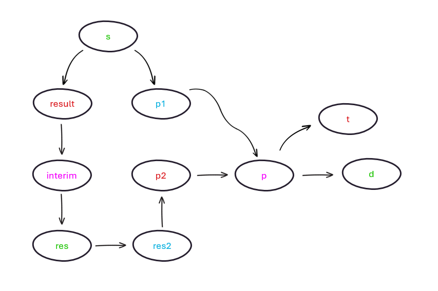
</p>

#### Comments

As expected, there were no significant hurdles in implementing this DAG through Dagger, and the resulting .gif can be observed below.

<p align="center">
  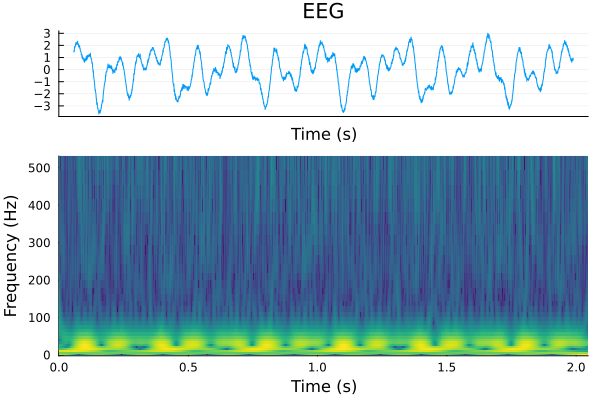
</p>

#### `Commit links:`

- [Main commit](https://github.com/davidizzle/GSoC-Dagger.jl-Blog/commit/d6b60dbb13377096cac3968f57b0df548179cdbc)

### 3.3 Webstreaming

Another use case for streaming DAGs with Dagger would be to stream webcam image data — e.g. webstreaming — and carry out some sort of processing on it — background blurring, filtering, et cetera.

Our next example was to use the [VideoIO.jl](https://github.com/JuliaIO/VideoIO.jl) library to capture frames from the computer webcam and filter it through a Dagger DAG.
However, this was an unsuccessful attempt: the streaming and processing per se likely worked out fine, but it doesn't seem to be immediately clear how to update image display using Dagger streaming. The below implementation makes use of the `imshow()` function from [ImageView.jl](https://github.com/JuliaImages/ImageView.jl), but the canvas fails to update. In the interest of time, this specific application was parked.

```Julia
Dagger.spawn_streaming() do
    cam = VideoIO.opencamera()
    fr = VideoIO.read(cam)
    guidict = ImageView.imshow(fr)
    sleep(0.1)

    frame = Dagger.@spawn read_frame(cam)
    p1 = Dagger.@spawn ImageView.imshow(guidict["gui"]["canvas"], frame)
end
```

#### `Commit links:`

- [Main commit](https://github.com/davidizzle/GSoC-Dagger.jl-Blog/commit/4c14ec57daf3a4a225b38d6528ca28934e17c754)

### 3.4 Live image filtering

We didn't want to throw in the towel for a minor technical difficulty and thus we backtracked to filtering a live image feed. Applications are manifold — e.g. video surveillance or any type of live image filtering — and we provide a simple implementation leveraging the [ImageFiltering](https://juliaimages.org/ImageFiltering.jl/stable/) and [ColorTypes](https://github.com/JuliaGraphics/ColorTypes.jl) packages.

Dagger's API looks pretty simple:

```Julia
Dagger.spawn_streaming() do

    video = VideoIO.openvideo(video_path)

    img = Dagger.@spawn read_vid(video)
    frame = Dagger.@spawn filter_frame(img)
    # Push to task local storage
    imgarray = Dagger.@spawn push_aux_TLS(frame)
end
```

There is naturally no way to show, in this blog, streaming video output. It was hence necessary to take a finite video and accumulate the frames in an array at the end of the streaming DAG, which can then be converted into an output video.
We performed this for a number of files  — either greying out, blurring, or applying odd filtering — the results of which are shown below.

#### Video 1: Woman walking dogs

[Original video](https://www.youtube.com/shorts/ERhf95tULUo)
[Greyed out video](https://www.youtube.com/shorts/7SZULHj8r6c)

<p align="center">
  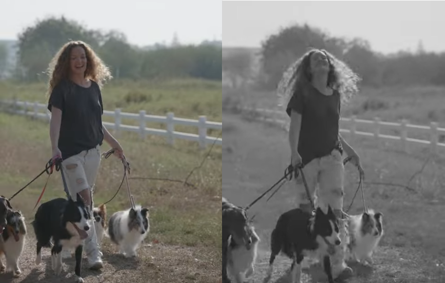
</p>

<small>*Video provided by [Pexels](https://www.pexels.com/search/videos/)*</small>

#### Video 2: Cats

[Original video](https://www.youtube.com/shorts/GFIqhz9YtGc)
[Blurred video](https://www.youtube.com/shorts/_IzBQyad_JM)
[Greyed out video](https://www.youtube.com/shorts/H73G8pdZ4EU)

<p align="center">
  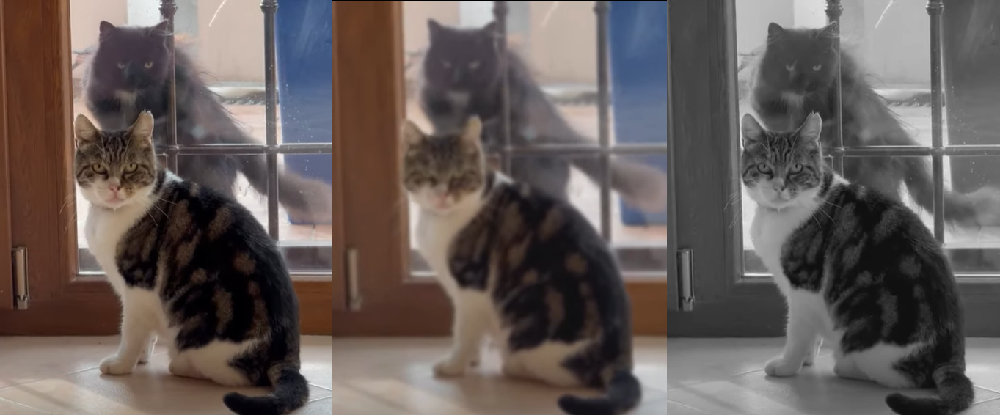
</p>

#### Video 3: Dogs walking

[Original video](https://www.pexels.com/video/footage-of-a-man-walking-with-dogs-3725511/)
[Laplacian](https://youtu.be/quT_fpLrnZg)

<p align="center">
  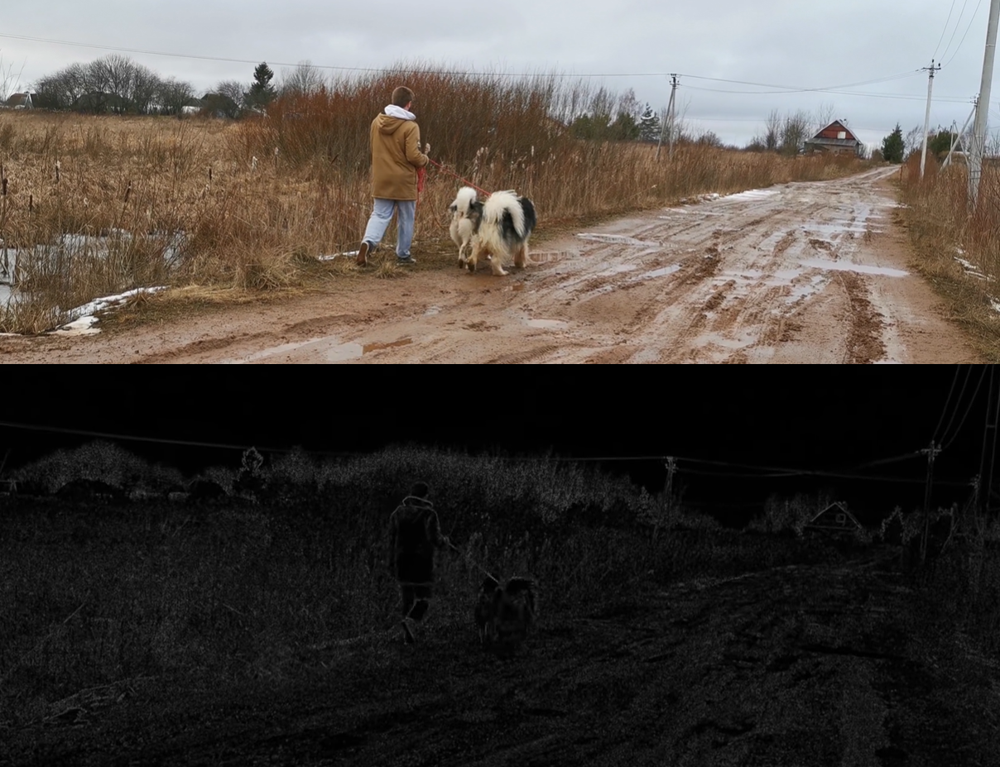
</p>

<small>*Video provided by [Pexels](https://www.pexels.com/search/videos/)*</small>

#### `Commit links:`

- [Main commit](https://github.com/davidizzle/GSoC-Dagger.jl-Blog/commit/4c14ec57daf3a4a225b38d6528ca28934e17c754)

### 3.5 Live object detection

Perhaps a more specific use case of image filtering is image processing for live object detection.

This initially proved to be a challenge leveraging [YOLO](https://pjreddie.com/darknet/yolo/), wrapped in the Julia package [ObjectDetector.jl](https://github.com/r3tex/ObjectDetector.jl), because of the DAG's temporal interdependency which is not immediate to implement for streaming tasks.
We used the YOLOv3-tiny model and for simplicity, and for the sake of real-time streaming and low resource utilization, we picked a batch size of 1 — though this is definitely a tuneable parameter that can improve accuracy.

The final `stack` task in the code below accumulates inference output images and writes to a video file, which has been linked below.

```Julia
Dagger.spawn_streaming() do
    global stack
    video = VideoIO.openvideo(video_source)
    # Load the YOLOv3-tiny model pretrained on COCO, with a batch size of 1
    yolomod = YOLO.v3_608_COCO(batch=1, silent=true)
    imgstack = Vector()
    batch = emptybatch(yolomod)

    img = Dagger.@spawn read_vid(video)
    b = Dagger.@spawn prepare_imgaux_b(img, yolomod)
    padding = Dagger.@spawn prepare_imgaux(img, yolomod)
    res = Dagger.@spawn yolomodAux(batch, b, yolomod)
    imgBoxes = Dagger.@spawn drawBoxesAux(img, yolomod, padding, res)
    stack = Dagger.@spawn push_aux_TLS(imgBoxes)
end
```

The main trouble I ran into when deploying this inference model with Dagger streaming was the one-step lag needed when passing the `batch` variable to the YOLOv3-tiny model, which presumably feeds on previous images.
I have shown this in the diagram below — while the DAG itself does not include a lot of nodes and edges, it does include the one-step lag represented by the $z^{-1}$ arrow.

<p align="center">
  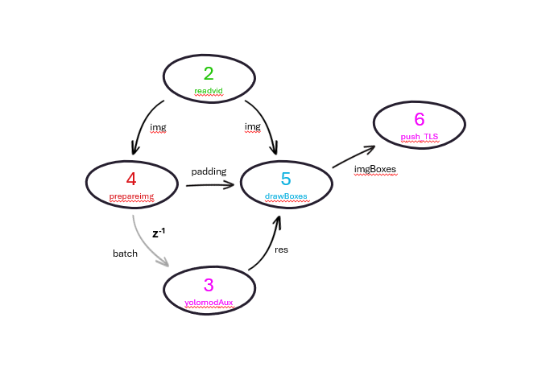
</p>

Given that DAG loops or complicate interdependencies might not still be comprehensively supported, I worked around this for showcasing purposes in a bit of a hacky way.

As shown below, the yolomodAux task stores in its internal `task_local_storage()` the *new* value received by the `prepareImg` task, popping the *previously inserted* one (if any) at each iteration. This simulates a data feed lag of one-step — which can be generalizable to an $n$-step lag by implementing an $n$-element queue in the TLS of the task, pushing and popping at each iteration.

```Julia
function yolomodAux(batch, aux, yolomod)
    
    # Introduce one-time lag
    if haskey(task_local_storage(), "batch")
        batch[:,:,:,1] = task_local_storage("batch")
    end
    task_local_storage("batch", aux)
    output = yolomod(batch, detectThresh=0.5, overlapThresh=0.8)
    return output
end
```

[Original video](https://youtu.be/OaGZcJo-oPY)
[YOLO Object Detection](https://youtu.be/mZ0uAs-7OiA)

<p align="center">
  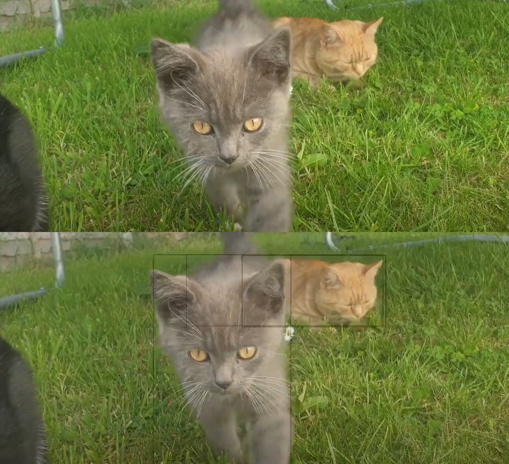
</p>

<small>*Video provided by [Pexels](https://www.pexels.com/search/videos/)*</small>

#### Comments

This example highlighted how we eventually might need to think about all possible edge cases when constructing DAGs with feedback systems, and potentially including safety checks for potential user misconstructed DAGs.
We may include options for this in the future Dagger API for ease of use, but for now it remains the user's responsibility to flesh this logic out in auxiliary functions in a similar fashion to what I did above.

#### `Commit links:`

- [Main commit](https://github.com/davidizzle/GSoC-Dagger.jl-Blog/commit/183282c473781aa726a71e85d8c80b41d52779a1)

****

## 4. Extras

### 4.1 What is left to do?

- PRs for cancellation support for `Distributed.jl`, `CUDA.jl`, `AMDGPU.jl`, `oneAPI.jl`, `MemPool.jl`.
- Adding full GPU support to Dagger, and zero-allocation automatic CPU-GPU transfers
- Benchmark streaming DAG performance and allocations
- Increase testset for networking protocols
- Include full support for message queue based protocols, i.e. NATS, MQTT, ZeroMQ

## 4.2 Attending JuliaCon

The JuliaCon 2024 was hosted in Eindhoven, NL during the week of July 9th–13th.
I managed to fly in for the last two days (Friday, July 12th and Saturday, July 13th) just in time to see Julian's brief presentation on Dagger (which followed the [Workshop](https://www.youtube.com/watch?v=ENq05cxw1eY) presented at TU/e on Tuesday).

Many attendees, especially researchers in HPC, expressed their interest in additional features needed for Dagger's high parallelism, such as remote task graceful cancellation or GPU support.

During Saturday's morning workshop, Julian, Dr. P. Szufel and I resumed some of our discussions on Dagger.

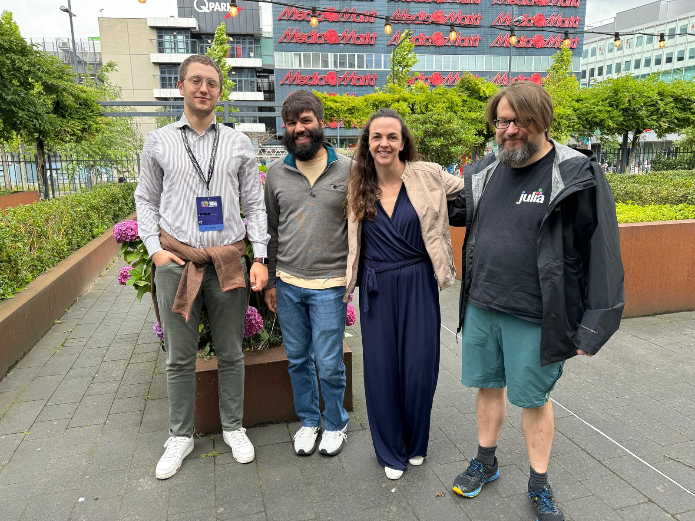
*JuliaCon Eindhoven 2024*

### Acknowledgments

My special, heartfelt thanks go to [J. Samaroo](https://github.com/jpsamaroo) and [J. Wrigley](https://github.com/JamesWrigley) for their awesome mentorship through the Google Summer of Code program, which has truly taught me more than I could imagine — about programming, about Julia, about HPC, but more especially about teamwork and the importance of helping each other.
To many more lines of code of contribution and projects built together!
