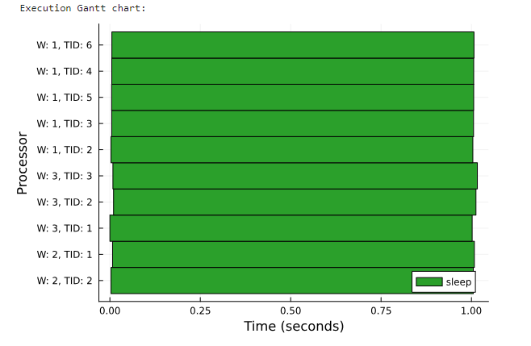
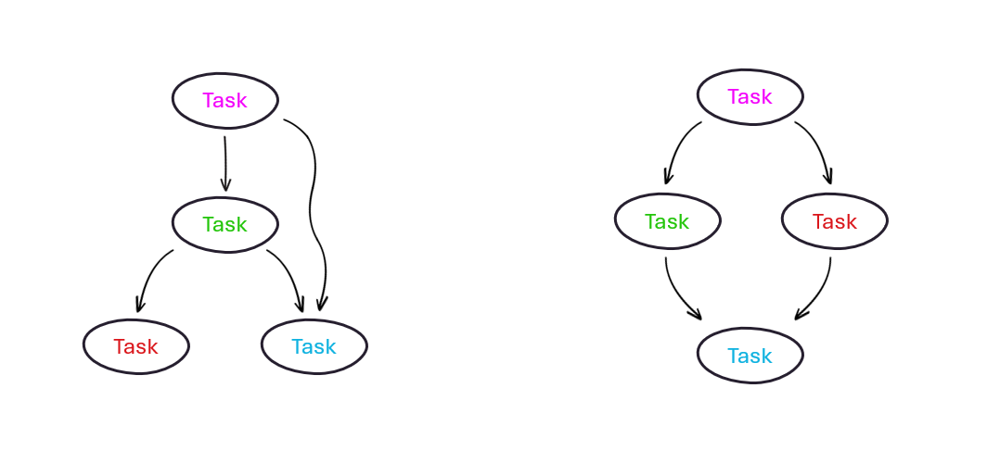
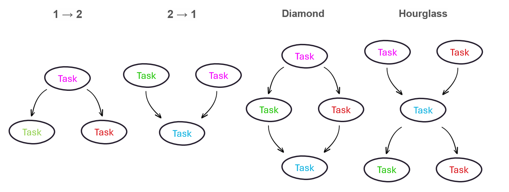
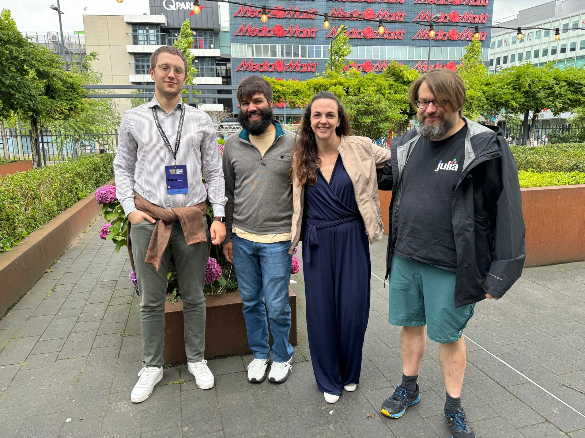

# GSoC Blog


## 1. Introduction

### 1.1 Dagger.jl Recap

#### *Parallelism Made Easy*


It is typically a cumbersome exercise, for programmers, to quickly and efficiently deploy multithreaded, distributed, or GPU computation.

Doing all three at once is then certainly no easy feat — but that is where [Dagger.jl](https://github.com/JuliaParallel/Dagger.jl) swoops in!

Dagger is a Julia module that brings all three together and makes parallelism easy for the user — it acts as a unified task interface and aims to solve difficult problems such as:

- Cross-task dependency/synchronization
- Abstracting computation across servers, threads, and GPUs
- Dynamic workload balancing
- Automating data transfer and worker migration, while hiding latency
- Automating GPU utilization and data conversion

As a result, though the user might even be agnostic to concurrency and parallelism, leveraging Dagger's API she is able to tinker with high performance computing — *in seconds*.

See Dagger's parallelism capabilities through the 3 lines of code below:

```Julia
for i in 1:10
    Dagger.@spawn sleep(1)
end
```


If you want to learn more about how Dagger works or want to deep-dive into the specifics of how Dagger makes all of this happen behind the scenes, check out the [Dagger Workshop](https://github.com/jpsamaroo/DaggerWorkshop2024) from the [Productive Parallel Programming](https://www.youtube.com/watch?v=ENq05cxw1eY&t=1388s) conference at JuliaCon 2024!

### 1.2 Our proposed objectives

#### *Enter: DAGs*

Dagger has recently been incorporating streaming functionality in its `jps/stream2` branch, which allows users to implement task DAGs through a streaming queue of tasks (see examples below). Again, these *streaming* tasks can then seamlessly be deployed in a multi-threaded, multi-process fashion which can also leverage a heterogeneous set of computing resources.



At the beginning of the GSoC contribution program, we set some ambitious goals:

1. **Tooling for Task Execution Validation**: we aimed to develop tools to ensure tasks execute with minimal memory allocation, which enhances performance by avoiding garbage collector pauses and overhead from allocation itself.
2. **Data Transfer Mechanisms**: Implement an optimized mmap-backed ring buffer for inter-process communication and implement support for various protocols (TCP, UDP, NATS, MQTT) for cross-network transfers.
3. **Heterogeneous Streaming Infrastructure**: Create infrastructure to facilitate executing streaming tasks on GPUs/DPUs and streaming data directly to/from them and CPUs.
4. **Performance Benchmarking**: Benchmark the streaming DAG performance using a standard benchmark problem to assess efficiency improvements.
5. **Robustness Testing**: Implement a set of benchmarks of streaming DAG performance, using real-world radio/RADAR analyses and source data to assess efficiency and reliability.
****

## 2. GSoC Code Additions

To tackle all these goals, the first step was to validate what was already in place, identifying potential faults, bugs, or inefficiencies — in other words, we needed to create an exhaustive streaming testset which would probe all potential pain points of our vision.

### 2.1 Building a Streaming Testset

To gain more confidence in the robustness, effectiveness, and versatility of streaming tasks, a comprehensive collection of tests was written during the first few weeks.

These included many possible combinations for DAGs — namely single tasks running finitely or infinitely, multiple configurations of tasks (1 → 2, 2 → 1, diamond, hourglass as per figure below), which were spawned themselves on combinations of different threads and workers.



<!-- Afterward, the allocation of task streams was also gauged to earn more confidence around `stream.jl`’s ability to not require further allocation — effectively slowing down performance, increasing the number of calls for garbage collection, and adding overhead. -->

The full test list, at this point of the program, is provided below:

- Checking a single "finite" task correctly finishes and returns
- Checking single "infinite" task never finishes and keeps spinning
- Checking all DAG configurations above and simpler correctly and predictably finish
- Checking tasks can stream different element types, e.g. mutable and immutable
- Checking all of the above tests continue passing if we mix up the threads and workers we allocate them to — ensuring cross-worker streaming

The new streaming feature ultimately passed all initial tests, which seemed to awarded enough reliability to `stream.jl` that we could start thinking about networking protocols implementation for streaming data.

<!-- which earned the developers enough confidence to merge it with the main branch. -->

#### `Commit links:`

- [Adding first tests](https://github.com/davidizzle/Dagger.jl/commit/1f00a670acafc6d36448deb34f9805a8a17cb194)
- [Mixing workers and threads test](https://github.com/davidizzle/Dagger.jl/commit/6c6599a9f8fab4673f0375f1a74f793ae75b3ece)
- [Corrections](https://github.com/davidizzle/Dagger.jl/commit/d1ec262fc9299e56c6c22deff686c1ba26fee75a)
- [More tests added](https://github.com/davidizzle/Dagger.jl/commit/7b9b057729be4682306929d97f9cd99e79e14c64)

### 2.2 Testing Networking Protocols

Given the desire to build Dagger’s streaming functionality towards heterogeneous computing and highly performing network communication, several networking protocols were tested.

Workers were able to communicate over the wire through Julia’s built-in TCP and UDP libraries effectively — with scripts initially testing transmission of singular and vectors of `Float64` values without serialization, respectively.

For MQTT and NATS — popular message queue protocols, one often used in IoT and the latter in microservices for its lightweight nature — libraries were sourced within the Julia community, respectively employing [Mosquitto.jl](https://github.com/denglerchr/Mosquitto.jl) and [NATS.jl](https://github.com/jakubwro/NATS.jl). Message queues work via a pub/sub system, where certain workers publish to a message queue, and only the workers subscribed to the same queue (see: topic) receive the data — in this case, a single publisher was tested to publish single and vectors of `Float64` values, with a single subscriber successfully pulling the data from the message queue.

#### `Commit links:`

- [First draft of pull/push network protocols...](https://github.com/davidizzle/Dagger.jl/commit/05aa462d7ee732a8d4a15eb5656bcdecfcefabf0)
- [...with corrections](https://github.com/davidizzle/Dagger.jl/commit/1babb00ee710e1754a14023b0258e9a75e9e64b1)

### 2.3 Memory-Mapped Ring Buffer Rollout

Through the `Mmap.jl` library, which helps with memory-mapping of files, a new type of buffer was initially implemented in the following couple of weeks — an `mmapRingBuffer`, i.e. a ring buffer mapping data on disk. The rationale behind a memory-mapped ring buffer is to eliminate the overhead from allocations of extra space when copying buffer data, but rather having a downstream task in a DAG access the same memory used by the upstream’s ring buffer.

This was implemented locally, but ended up being tabled — hence no commits were ever pushed with this specific change. It remains in the to-dos for potential future use.

### 2.4 Graceful cancellation and signal interrupts

The biggest detour from the original objective list during the GSoC program was likely the realization of the necessity to implement a requested and highly useful feature for any multi-threaded, distributed library: the possibility to cancel scheduled and executing tasks alike, which may otherwise keep spinning indefinitely.

This, effectively, meant altering the very way Julia handles signal interrupts from the user — including alternative ways that clean up left over tasks.

The main Dagger developers were busy 

#### `Commit links:`

- [Minor preliminary bug fixing](https://github.com/davidizzle/julia/commit/b9410663a03a063ead2772876fe2c7fb671a2cda) and [more](https://github.com/davidizzle/julia/commit/2512144e041d27b8ab62afbf51bde0288b90f618)
- [Cancellation sigint tests and including handlers](https://github.com/davidizzle/julia/commit/ff1b731c9da07b81d50958341f96e0cb67c8e421)
- [Including forceful cancellation in Base.Threads](https://github.com/davidizzle/julia/commit/32e6883420a45ea64b67cd7c7f22e704a33c4548)
- [Including graceful cancellation through expression parsing in Base.Threads](https://github.com/davidizzle/julia/commit/8e4b148549201a41bf84cf1765a38818fb73cf69)

### 2.5 Piping and wiring networking protocols


## 3. What is left to do?

***

### Acknowledgments

My special, heartfelt thanks go to [J. Samaroo](https://github.com/jpsamaroo) and [J. Wrigley](https://github.com/JamesWrigley) for their awesome mentorship through the Google Summer of Code program, which has truthfully taught me more than I could imagine — about programming, about Julia, about HPC, but more especially about teamwork and the importance of helping each other.
To many more lines of code of contribution and projects built together!


*JuliaCon Eindhoven 2024*
